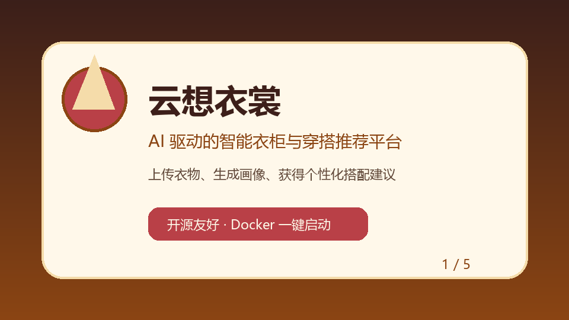

<p align="center">
  <br>
  
</p>

<p align="center">
  <a href="LICENSE"></a>
  
  
  
  
  
</p>

<h2 align="center">AI 驱动的智能衣柜与穿搭推荐平台</h2>
<p align="center">
  上传衣物 → AI 自动标注 → 生成风格画像 → 获得个性化穿搭推荐<br>
  全部本地运行，数据不离开你的电脑
<br><a href="docs/API.md">API 文档</a> · <a href="docs/ARCHITECTURE.md">架构总览</a> · <a href="docs/DEPLOY.md">部署指南</a> · <a href="docs/FAQ.md">常见问题</a> · <a href="docs/SCREENSHOTS.md">功能截图</a>
</p>

---

## ✨ 核心功能

| 模块 | 能力 | 技术栈 |
|:---|:---|:---|
| **智能衣柜** | 以图片和标签管理日常单品，批量导入 + 去重 | Flask + SQLAlchemy + CLIP |
| **风格画像** | 分析衣柜单品，生成个人风格分布报告 | CLIP + 自训练分类器 |
| **AI 推荐** | 结合图片相似度、天气与个人画像，推荐搭配方案 | CLIP + BLIP + 天气 API |
| **图像搜索** | 用一张图片在图库中找到相似商品 | MobileNetV2 + cosine similarity |
| **时尚顾问** | 用自然语言获得穿搭建议 | Ollama (本地 LLM) |

---

## 🚀 快速开始

### 环境要求

- Python 3.10+
- MySQL 8.0+
- (可选) NVIDIA GPU + CUDA — 推理更快
- (可选) [Ollama](https://ollama.ai) — 启用 AI 时尚顾问

### 1. 克隆仓库

```bash
git clone https://github.com/yourname/yunxiangyishang.git
cd yunxiangyishang
```

### 2. 安装依赖

```bash
python -m venv venv
source venv/bin/activate   # Windows: venv\Scripts\activate
pip install -r requirements.txt
```

### 3. 配置环境变量

```bash
cp .env.example .env
# 编辑 .env，填入你的 MySQL 密码等信息
```

### 4. 初始化数据库

```sql
CREATE DATABASE fashion_db CHARACTER SET utf8mb4 COLLATE utf8mb4_unicode_ci;
```

首次运行时 Flask 会自动创建表和默认管理员账户（`admin` / `admin123`）。

### 5. 下载 AI 模型

项目使用 CLIP 和 BLIP 做图像理解。首次启动时会自动从 HuggingFace 下载到 `app/models/`，也可以手动放置：

```bash
# CLIP (OpenAI)
git clone https://huggingface.co/openai/clip-vit-base-patch32 app/models/clip-vit-base-patch32

# BLIP (Salesforce)
git clone https://huggingface.co/Salesforce/blip-image-captioning-base app/models/blip-image-captioning-base
```

### 6. 启动

```bash
python run.py
# 访问 http://localhost:5000
```

---

## 🐳 Docker 一键部署

```bash
# 构建并启动所有服务
docker-compose up --build

# 后台运行
docker-compose up -d
```

服务启动后访问 `http://localhost:5000`。

---

## 📁 项目结构

```
yunxiangyishang/
├── app/                      # Flask 应用主目录
│   ├── __init__.py           # 应用工厂
│   ├── models.py             # SQLAlchemy 模型
│   ├── extensions.py         # Flask 扩展与工具函数
│   ├── auth/                 # 认证（登录 / 注册 / 密码重置）
│   ├── main/                 # 首页与账户管理
│   ├── wardrobe/             # 智能衣柜 CRUD + 诊断
│   ├── search/               # 商品搜索 + 图像搜索
│   ├── recommendation/       # AI 穿搭推荐 + 天气
│   ├── fashion_advisor/      # AI 时尚顾问（Ollama）
│   ├── style_analysis/       # 风格画像分析
│   ├── services/             # AI 服务层（CLIP / BLIP）
│   └── models/               # 本地 AI 模型权重（.gitignore）
├── config/                   # 配置（从 .env 读取）
├── static/                   # 静态资源（CSS / JS / 图片）
├── templates/                # Jinja2 模板
├── tests/                    # 测试
├── docs/                     # 文档与资源
│   ├── API.md                # REST API 接口文档
│   ├── ARCHITECTURE.md       # 架构总览与模块交互
│   ├── DEPLOY.md             # 部署指南（本地/Docker/生产）
│   ├── FAQ.md                # 常见问题解答
│   └── SCREENSHOTS.md        # 功能截图展示
├── .env.example              # 环境变量模板
├── requirements.txt          # Python 依赖
├── Dockerfile                # 容器镜像
├── docker-compose.yml        # 编排配置
├── LICENSE                   # MIT 许可证
└── README.md                 # 本文件
```

---

## 🔒 安全说明

- 所有敏感信息通过 `.env` 管理，已加入 `.gitignore`
- 密码使用 `werkzeug` 安全哈希存储
- 文件上传使用 UUID 重命名，防止路径穿越
- 登录状态受 `flask-login` 保护，支持 `session_protection = "strong"`

---

## 🗺️ 路线图

- [ ] Celery 异步任务（特征提取 / 批量导入）
- [ ] 购物车从 Session 迁移到数据库
- [ ] 前端 SPA 改造（Vue / React）
- [ ] 支持更多 LLM 后端（vLLM / llama.cpp）
- [ ] 国际化（i18n）支持
- [ ] 移动端适配优化
- [ ] 多语言 UI（中文 / 英文）

---

## 🤝 参与贡献

欢迎所有形式的贡献！请阅读 [CONTRIBUTING.md](CONTRIBUTING.md) 了解详情。

1. Fork 本仓库
2. 创建特性分支（`git checkout -b feature/amazing-feature`）
3. 提交更改（`git commit -m 'Add amazing feature'`）
4. 推送到分支（`git push origin feature/amazing-feature`）
5. 发起 Pull Request

---

## 📄 许可证

本项目基于 [MIT License](LICENSE) 开源，欢迎自由使用、修改和分发。

---

<p align="center">
  <sub>Built with ❤️ by the 云想衣裳 community</sub>
</p>
